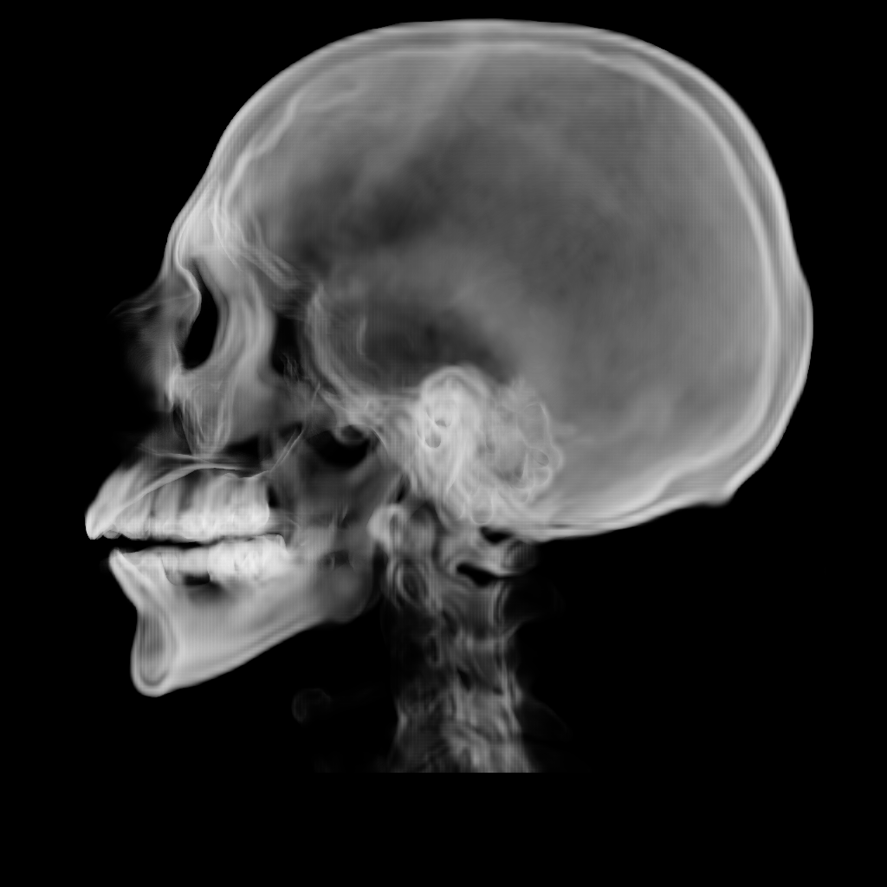
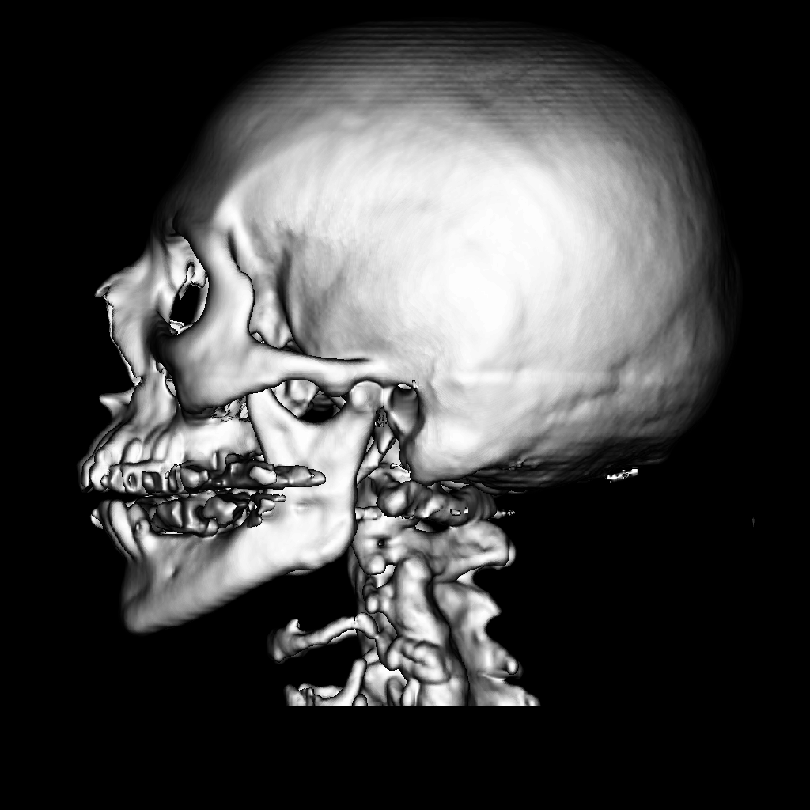

# Volume Visualisation

MRI and CT scans produce datasets as a series of stacked 2D images, which can be visualised using 3D algorithms. 

## Example data
The included .raw data have the following properties: header of 62 bytes followed by the imaging data consisting of 225 images
with 2562 pixels encoded as 8-bit Grayscale unsigned byte data. 

### Command Line Example
Args: width height depth header_size isovalue projection_axis direction
```
java vis 256 256 225 62 95 0 false
```

## Results

 </br>
 </br>
